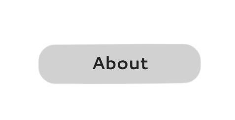
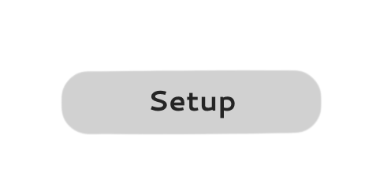
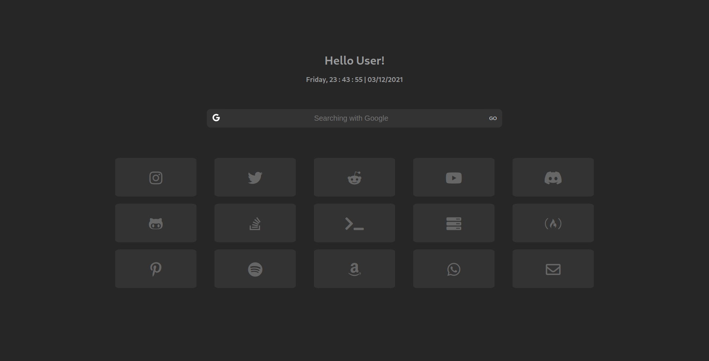

  

<h1>Starthome</h1>

## About

Starthome is a minimalistic and simp startpage/homepage with a navigation bar with 4 search engines and icons as buttons redirecting to desired site.

## Preview

 Hosted version of the webpage - 

## Setup

<h2>Local</h2>

1. Install the extension - [chrome](https://chrome.google.com/webstore/detail/new-tab-redirect/icpgjfneehieebagbmdbhnlpiopdcmna) [firefox](https://addons.mozilla.org/en-US/firefox/addon/new-tab-override/)
2. Install the Startpage zip and unzip it
3. Open the index.html file
4. Copy the file location in the url box
5. Paste it in the Extensions url box and save it
6. Done

<h2>Hosted</h2>

Same thing but enter the url of the website (https://starthome.netlify.app) in the url box while editing the extension settings

